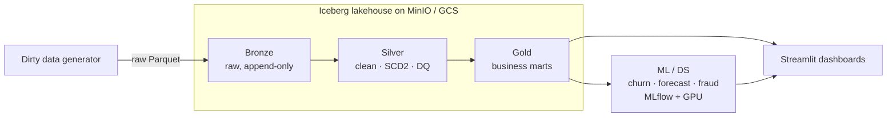

# 🛒 MegaMart — a modern open data lakehouse, end to end

**Dirty data → Bronze → Silver → Gold → ML → dashboards**, built on the open lakehouse stack
(**Apache Iceberg · Apache Spark · MinIO/S3 · MLflow · Streamlit**) and designed to run **locally for $0**
and **on GCP** unchanged.

---

## What this is

MegaMart is a **fictional national retailer** whose data I generate *deliberately dirty* — nulls, duplicates,
orphan foreign keys, mixed currencies, timezone-naive and late-arriving events — and then engineer all the way
to trustworthy, governed analytics and machine-learning products. It's a single, coherent project that shows
the **full data-engineering lifecycle** the way a real production data house runs it, on **vendor-neutral open
tooling** (not tied to any one managed platform).

The pipeline is **scale-factor driven**: the same code produces ~1 GB for a dev loop or **hundreds of GB** for a
genuine big-data run, exercising real shuffles, spill, and partition tuning.

## Architecture

## Stack & why

| Layer | Technology | Why |
|---|---|---|
| **Storage** | MinIO (local) → GCS (cloud) | S3-compatible object store; same `s3a://` code runs both places |
| **Table format** | **Apache Iceberg** | ACID, time-travel, hidden partitioning, schema evolution — the open lakehouse standard |
| **Catalog** | Hadoop catalog → Apache Polaris | Governance + discoverability (the open answer to Unity Catalog) |
| **Engine** | **Apache Spark 3.5** (PySpark) | Distributed compute; tuned for a 16-core / 48 GB local rig |
| **ML** | MLflow + XGBoost (GPU) + SHAP | Tracked, registered, explainable models |
| **Dashboards** | Streamlit | Python-native BI over the Gold layer |
| **Cloud** | GCS · Dataproc · BigQuery | Cloud deployment reads the same Iceberg tables |

## The medallion layers

- **Bronze** — raw ingest into Iceberg, append-only, every row kept (even bad ones), stamped with ingest lineage.
- **Silver** — cleaned & conformed: typed, deduplicated (window functions), currency/timezone normalized,
  **orphan foreign keys quarantined** (not dropped), clickstream **sessionized with event-time watermarks**, and
  a star schema whose dimensions keep full history via **Slowly-Changing-Dimension Type 2** (Iceberg `MERGE`).
- **Gold** — business marts: daily revenue, customer-360 / RFM, funnel conversion, cohort retention, fraud
  summary — partitioned and compacted for fast serving.

## Machine learning

Feature tables from Gold drive a full, production-style ML lifecycle: **churn** (GPU XGBoost, AUC/PR on
imbalanced data), **demand forecasting**, and **fraud** detection — all tracked in **MLflow** (params, metrics,
artifacts), promoted through a **model registry**, explained with **SHAP**, batch-scored back into the lakehouse,
and monitored for **drift**.

## Build status

> Honest status — this is an actively-built portfolio project.

- ✅ Environment & tuned Spark session (16 cores / 48 GB, Iceberg-ready) — verified end-to-end
- ✅ Scale-factor dirty-data generator
- ✅ Iceberg write→read to object storage — verified
- ✅ Bronze ingestion
- ✅ Silver (clean · SCD2 · DQ) · Gold marts
- ⬜ ML (churn / forecast / fraud) with MLflow
- ⬜ Streamlit dashboards
- ⬜ GCP deployment (GCS · Dataproc · BigQuery)
- ⬜ Daily-batch "job simulator" generator

## Running it

Local, $0: **Python 3.12 + PySpark 3.5 + Java 17**, a single MinIO bucket, and Iceberg jars pulled on first run.
See the pipeline scripts under `gen/`, `lib/`, and `pipelines/`. The cloud deployment runs the identical code
against GCS + Dataproc + BigQuery.

## What this demonstrates

Ingestion · Iceberg/ACID lakehouse · medallion architecture · SCD2 · data-quality gating · streaming &
sessionization · star-schema modeling · Spark performance tuning · the MLflow model lifecycle · model
explainability · dashboarding · and a **local ↔ cloud** deployment story.

---

*Built by **Scott Baker** — data engineering / PySpark / lakehouse / ML.*
